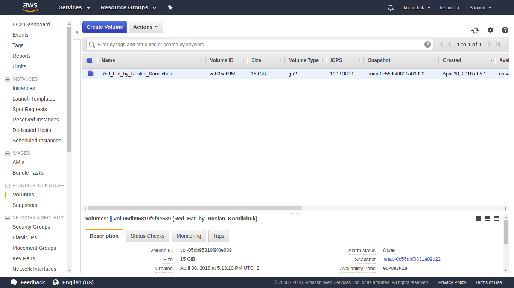
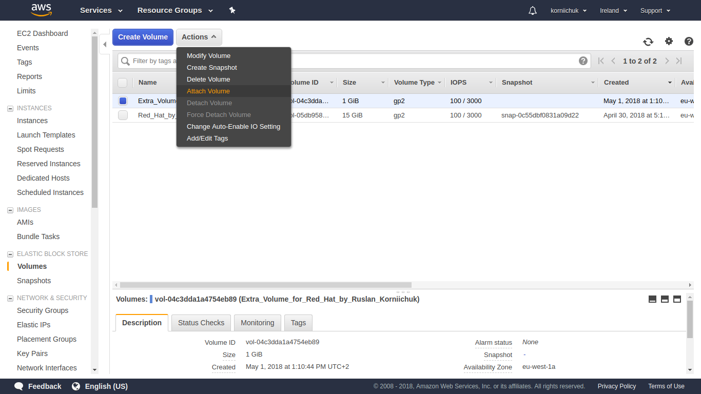
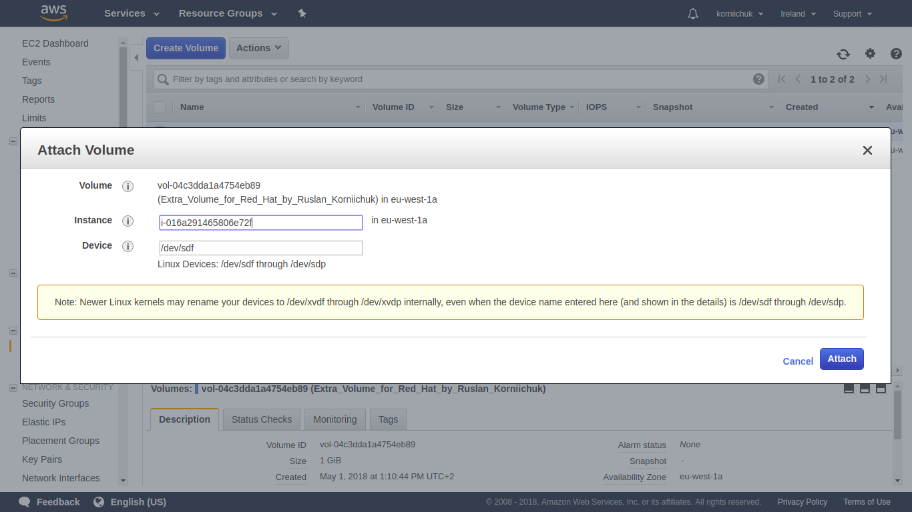

# Configure Linux Red Hat 7 LVM via Ansible

## Table of Contents
* **[Short Description](#short-description)**
* **[Full Description](#full-description)**
* **[Creat Volume for VM via AWS](#creat-volume-for-vm-via-aws)**
  * **[Create Volume](#create-volume)**
  * **[Attach Volume](#attach-volume)**
* **[Add File System on Volume](add-file-system-on-volume)**

## Short Description
Ansible LVM

## Full Description
LVM configuration using Ansible 2.4/2.5 in Red Hat Enterprise Linux (RHEL) 7.4/7.5.

## Creat Volume for VM via AWS
You can create an Amazon EBS volume that you can then attach to any EC2 instance within the same Availability Zone.
### Create Volume
1st, open [Amazon EC2 console](https://console.aws.amazon.com/ec2/).

2nd, from the navigation bar, select the region in which you would like to create your volume. In the navigation pane, choose `ELASTIC BLOCK STORE`, `Volumes`. See images below:


3rd, choose `Create Volume`. See images below:



4th, for `Volume Type`, choose a volume type. For `Size (GiB)`, type the size of the volume. For `Availability Zone`, choose the Availability Zone in which to create the volume. EBS volumes can only be attached to EC2 instances within the same Availability Zone. Choose `Create Volume`. See images below:


5th, choose `Close`. See images below:


### Attach Volume
1st, open [Amazon EC2 console](https://console.aws.amazon.com/ec2/).

2nd, in the navigation pane, choose `Elastic Block Store`, `Volumes`. Select an available volume and choose `Actions`, `Attach Volume`. See images below:



3rd, for `Instance`, start typing the name or ID of the instance. Select the instance from the list of options (only instances that are in the same Availability Zone as the volume are displayed). See images below:


4th, for `Device`, you can keep the suggested device name. Choose `Attach`. See images below:



## Add File System on Volume
### Install lvm2:
```
$ sudo yum install -y lvm2
```
### List block devices:
```
$ lsblk -d
```
Where:
* `-d` or `--nodeps` -- do not print holder devices or slaves.

Example:
```
$ lsblk -d
NAME MAJ:MIN RM SIZE RO TYPE MOUNTPOINT
xvda 202:0    0  15G  0 disk
xvdf 202:80   0   1G  0 disk
```
### Ceate a new physical volume with the pvcreate command:
```
$ sudo pvcreate PV
```
Where:
* `PV` -- physical volume.

Example:
```
$ sudo pvcreate /dev/xvdf
Physical volume "/dev/xvdf" successfully created.
```
### Check physical volumes
```
$ sudo pvscan
PV /dev/xvdf                      lvm2 [1,00 GiB]
Total: 1 [1,00 GiB] / in use: 0 [0   ] / in no VG: 1 [1,00 GiB]
```
or
```
$ sudo pvs
PV         VG Fmt  Attr PSize PFree
/dev/xvdf     lvm2 ---  1,00g 1,00g
```
or
```
$ pvdisplay
"/dev/xvdf" is a new physical volume of "1,00 GiB"
--- NEW Physical volume ---
PV Name               /dev/xvdf
VG Name
PV Size               1,00 GiB
Allocatable           NO
PE Size               0
Total PE              0
Free PE               0
Allocated PE          0
PV UUID               yWyrLo-K2DT-3GBP-D5YE-NeRL-3ef1-NJyX59
```
### Ceate a new volume group with the vgcreate command:
```
$ sudo vgcreate VG PV
```
Where:
* `VG` -- volume group,
* `PV` -- physical volume.

Example:
```
$ sudo vgcreate 0001vg /dev/xvdf
Volume group "0001vg" successfully created
```
### Check volume group
```
$ sudo vgscan
Reading volume groups from cache.
Found volume group "0001vg" using metadata type lvm2
```
or
```
$ sudo vgs
VG     #PV #LV #SN Attr   VSize    VFree
0001vg   1   0   0 wz--n- 1020,00m 1020,00m
```
or
```
$ sudo vgdisplay
--- Volume group ---
VG Name               0001vg
System ID
Format                lvm2
Metadata Areas        1
Metadata Sequence No  1
VG Access             read/write
VG Status             resizable
MAX LV                0
Cur LV                0
Open LV               0
Max PV                0
Cur PV                1
Act PV                1
VG Size               1020,00 MiB
PE Size               4,00 MiB
Total PE              255
Alloc PE / Size       0 / 0
Free  PE / Size       255 / 1020,00 MiB
VG UUID               eeHHEq-UIRp-AnLf-bN2D-vnlo-G2a2-mQRPVE
```
