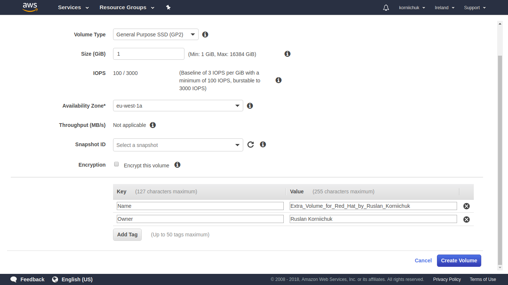
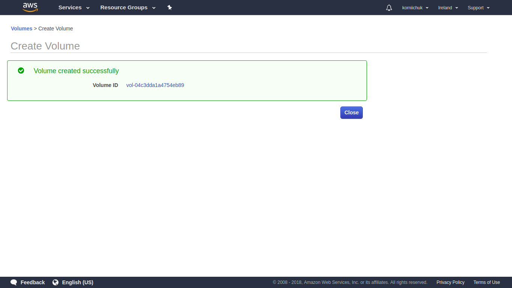

# Configure Linux Red Hat 7 LVM via Ansible

## Table of Contents
* **[Short Description](#short-description)**
* **[Full Description](#full-description)**
* **[Creat Volume for VM via AWS](#creat-volume-for-vm-via-aws)**
  * **[Create Volume](#create-volume)**
  * **[Attach Volume](#attach-volume)**
* **[Add File System on Volume](#add-file-system-on-volume)**

## Short Description
Ansible LVM

## Full Description
LVM configuration using Ansible 2.4/2.5 in Red Hat Enterprise Linux (RHEL) 7.4/7.5.

## Creat Volume for VM via AWS
You can create an Amazon EBS volume that you can then attach to any EC2 instance within the same Availability Zone.
### Create Volume
1st, open [Amazon EC2 console](https://console.aws.amazon.com/ec2/).

2nd, from the navigation bar, select the region in which you would like to create your volume. In the navigation pane, choose `ELASTIC BLOCK STORE`, `Volumes`. See images below:


3rd, choose `Create Volume`. See images below:


4th, for `Volume Type`, choose a volume type. For `Size (GiB)`, type the size of the volume. For `Availability Zone`, choose the Availability Zone in which to create the volume. EBS volumes can only be attached to EC2 instances within the same Availability Zone. Choose `Create Volume`. See images below:



5th, choose `Close`. See images below:



### Attach Volume
1st, open [Amazon EC2 console](https://console.aws.amazon.com/ec2/).

2nd, in the navigation pane, choose `Elastic Block Store`, `Volumes`. Select an available volume and choose `Actions`, `Attach Volume`. See images below:


3rd, for `Instance`, start typing the name or ID of the instance. Select the instance from the list of options (only instances that are in the same Availability Zone as the volume are displayed). See images below:


4th, for `Device`, you can keep the suggested device name. Choose `Attach`. See images below:


## Add File System on Volume
### Install lvm2:
```
$ sudo yum install -y lvm2
```
### List block devices:
```
$ lsblk -d
```
Where:
* `-d` or `--nodeps` -- do not print holder devices or slaves.

Example:
```
$ lsblk -d
NAME MAJ:MIN RM SIZE RO TYPE MOUNTPOINT
xvda 202:0    0  15G  0 disk
xvdf 202:80   0   1G  0 disk
```
### Ceate a new physical volume with the pvcreate command:
```
$ sudo pvcreate PV
```
Where:
* `PV` -- name of physical volume.

Example:
```
$ sudo pvcreate /dev/xvdf
Physical volume "/dev/xvdf" successfully created.
```
### Check physical volumes
```
$ sudo pvscan
PV /dev/xvdf                      lvm2 [1,00 GiB]
Total: 1 [1,00 GiB] / in use: 0 [0   ] / in no VG: 1 [1,00 GiB]
```
or
```
$ sudo pvs
PV         VG Fmt  Attr PSize PFree
/dev/xvdf     lvm2 ---  1,00g 1,00g
```
or
```
$ pvdisplay
"/dev/xvdf" is a new physical volume of "1,00 GiB"
--- NEW Physical volume ---
PV Name               /dev/xvdf
VG Name
PV Size               1,00 GiB
Allocatable           NO
PE Size               0
Total PE              0
Free PE               0
Allocated PE          0
PV UUID               yWyrLo-K2DT-3GBP-D5YE-NeRL-3ef1-NJyX59
```
### Ceate a new volume group with the vgcreate command:
```
$ sudo vgcreate VG PV
```
Where:
* `VG` -- name of volume group,
* `PV` -- name ofphysical volume.

Example:
```
$ sudo vgcreate 0001vg /dev/xvdf
Volume group "0001vg" successfully created
```
### Check volume group
```
$ sudo vgscan
Reading volume groups from cache.
Found volume group "0001vg" using metadata type lvm2
```
or
```
$ sudo vgs
VG     #PV #LV #SN Attr   VSize    VFree
0001vg   1   0   0 wz--n- 1020,00m 1020,00m
```
or
```
$ sudo vgdisplay
--- Volume group ---
VG Name               0001vg
System ID
Format                lvm2
Metadata Areas        1
Metadata Sequence No  1
VG Access             read/write
VG Status             resizable
MAX LV                0
Cur LV                0
Open LV               0
Max PV                0
Cur PV                1
Act PV                1
VG Size               1020,00 MiB
PE Size               4,00 MiB
Total PE              255
Alloc PE / Size       0 / 0
Free  PE / Size       255 / 1020,00 MiB
VG UUID               eeHHEq-UIRp-AnLf-bN2D-vnlo-G2a2-mQRPVE
```
### Ceate a new logical volume with the lvcreate command:
```
$ sudo lvcreate -l PERCENTAGE -n LV VG
```
Where:
* `-l` or `--extents` -- specify the percentage of the remaining free space in a volume group as the size of the logical volume,
* `PERCENTAGE` -- percentage,
* `-n` or `--name` -- specify the name of logical volume,
* `LV` -- name of logical volume,
* `VG` -- name of volume group.

The following command creates a logical volume called `0001lv` that uses all of the unallocated space in the volume group `0001vg`:
```
$ sudo lvcreate -l 100%FREE -n 0001lv 0001vg
Logical volume "0001lv" created.
```
### Check logical volumes
```
$ sudo lvscan
ACTIVE            '/dev/0001vg/0001lv' [1020,00 MiB] inherit
```
or
```
$ sudo lvs
LV     VG     Attr       LSize    Pool Origin Data%  Meta%  Move Log Cpy%Sync Convert
0001lv 0001vg -wi-a----- 1020,00m
```
or
```
$ sudo lvdisplay
--- Logical volume ---
LV Path                /dev/0001vg/0001lv
LV Name                0001lv
VG Name                0001vg
LV UUID                Png2PJ-zsDh-HR3W-UPBm-jHo0-VAWP-iI32lf
LV Write Access        read/write
LV Creation host, time ip-172-31-21-64.eu-west-1.compute.internal, 2018-05-01 13:26:54 +0000
LV Status              available
# open                 0
LV Size                1020,00 MiB
Current LE             255
Segments               1
Allocation             inherit
Read ahead sectors     auto
- currently set to     256
Block device           253:0
```
### Build/format a Linux file system
```
$ sudo mkfs.FSTYPE LV
```
Where:
* `FSTYPE` -- type of file system,
* `LV` -- name of logical volume.
Example:

```
$ sudo mkfs.xfs /dev/0001vg/0001lv
meta-data=/dev/0001vg/0001lv     isize=512    agcount=4, agsize=65280 blks
         =                       sectsz=512   attr=2, projid32bit=1
         =                       crc=1        finobt=0, sparse=0
data     =                       bsize=4096   blocks=261120, imaxpct=25
         =                       sunit=0      swidth=0 blks
naming   =version 2              bsize=4096   ascii-ci=0 ftype=1
log      =internal log           bsize=4096   blocks=855, version=2
         =                       sectsz=512   sunit=0 blks, lazy-count=1
realtime =none                   extsz=4096   blocks=0, rtextents=0
```
### Check type of file system
```
$ sudo parted -l
Model: Linux device-mapper (linear) (dm)
Disk /dev/mapper/0001vg-0001lv: 1070MB
Sector size (logical/physical): 512B/512B
Partition Table: loop
Disk Flags:

Number  Start  End     Size    File system  Flags
 1      0,00B  1070MB  1070MB  xfs
```
### Mount logical volume temporary
```
$ sudo mkdir /test
$ sudo mount /dev/0001vg/0001lv /test
```
### Mount logical volume permanently
1st, unmoumt volume and open `/etc/fstab` file:
```
$ sudo umount /test
$ sudo yum install -y nano
$ sudo nano /etc/fstab
#
# /etc/fstab
# Created by anaconda on Fri Mar 23 17:41:14 2018
#
# Accessible filesystems, by reference, are maintained under '/dev/disk'
# See man pages fstab(5), findfs(8), mount(8) and/or blkid(8) for more info
#
UUID=50a9826b-3a50-44d0-ad12-28f2056e9927 /                       xfs     defaults        0 0
```
2nd, manually add next line in `/etc/fstab` file:
```
/dev/0001vg/0001lv		/test		xfs		defaults		0 0
```
Example:
```
#
# /etc/fstab
# Created by anaconda on Fri Mar 23 17:41:14 2018
#
# Accessible filesystems, by reference, are maintained under '/dev/disk'
# See man pages fstab(5), findfs(8), mount(8) and/or blkid(8) for more info
#
UUID=50a9826b-3a50-44d0-ad12-28f2056e9927 /                       xfs     defaults        0 0
/dev/0001vg/0001lv		/test		xfs		defaults		0 0
```
3rd, check result:
```
$ sudo mount -a
$ df -h
Filesystem                 Size  Used Avail Use% Mounted on
/dev/mapper/0001vg-0001lv  3,0G   33M  3,0G   2% /test
```
